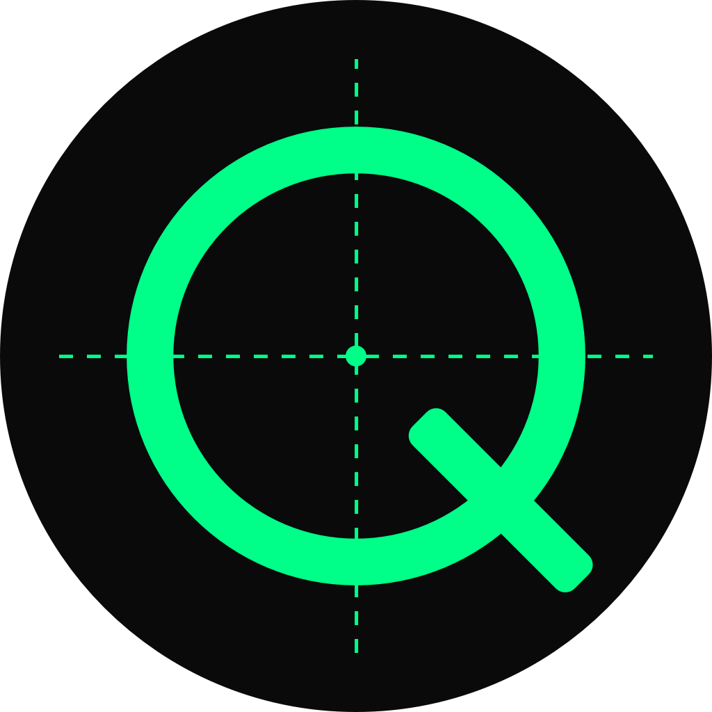

<div align="center">



# QuadWork

### Your AI dev team while you sleep.

<p>
  <a href="https://quadwork.xyz"><strong>Website</strong></a> ·
  <a href="#-quick-start"><strong>Quick Start</strong></a> ·
  <a href="#-how-it-works"><strong>How it Works</strong></a> ·
  <a href="#-features"><strong>Features</strong></a> ·
  <a href="#-external-tools"><strong>Credits</strong></a>
</p>

<p>
  <a href="https://www.npmjs.com/package/quadwork"></a>
  <a href="https://www.npmjs.com/package/quadwork"></a>
  
  
  
  <a href="LICENSE"></a>
</p>

</div>

---

## Installation Guides

Step-by-step guides for setting up QuadWork, designed for both humans and AI coding agents:

- **[Mac Installation](docs/install-mac.md)** — local setup on macOS
- **[Windows Installation](docs/install-windows.md)** — local setup via WSL2 (Windows Subsystem for Linux)
- **[VPS Installation](docs/install-vps.md)** — remote server (Hetzner/Ubuntu) with domain + SSL
- **[Troubleshooting](docs/troubleshooting.md)** — common issues and fixes
- **[Operator MCP](docs/operator-mcp.md)** — drive QuadWork from a Claude agent (`claude mcp add quadwork -- quadwork-mcp-operator --port 8400`)

> **For AI agents:** These guides contain complete step-by-step instructions. When your operator asks you to install or troubleshoot QuadWork, read the relevant guide and follow it.

## What is QuadWork?

**QuadWork** is a local-first, open-source automation framework that
orchestrates a team of four AI agents — **Head** (`@head`), **Dev** (`@dev`),
and two reviewers, **RE1** (`@re1`) and **RE2** (`@re2`) — through a governed
GitHub workflow. Head defines and assigns bounded tasks. Dev implements them,
RE1 and RE2 review independently, and Head delivers accepted work through an
exact-candidate verification and merge gate. Compatible tasks can share a
delivery; isolated changes keep separate gates.

<video src="https://github.com/user-attachments/assets/d1f6f3d6-27de-4afb-9b58-9fe1f87cddb8" width="720" controls></video>

[▶ View Live Demo on YouTube](https://www.youtube.com/watch?v=Q0814uXjYoQ)

[🌐 Visit quadwork.xyz](https://quadwork.xyz)

### How QuadWork Orchestrates Your Workflow

```
Issue → Branch → PR → Review × 2 → Merge
  ↑                                    │
  └──────── next ticket ───────────────┘
```

Head creates issues and freezes the task scope before assignment. One Dev task
builds at a time; an independent task with disjoint files can build while earlier
work is reviewed. RE1 and RE2 return independent verdicts. Head publishes a
delivery and merges only after current verification and both final approvals.
Queue advancement is a separate Head action; completion never starts another
batch automatically.

### Core Value Proposition

- **Unattended batches:** Head owns assignments and advancement. The Project Monitor sends Head a structured event only when a relevant state transition is due.
- **Multi-Agent Governance:** Unlike single-agent tools, QuadWork uses a system of checks and balances where a PR must clear two independent reviews before merging to `main`.
- **Privacy & Control:** Operates as a local Express server on your machine, driving your configured Codex, Claude, or Gemini CLIs and GitHub CLI sessions without third-party proxying.
- **Complete Visibility:** Features a comprehensive 4-quadrant dashboard with real-time agent terminals, chat history, and progress tracking.

## Why QuadWork?

Manually reviewing every AI-generated PR is exhausting. Letting one AI agent
push straight to `main` is how you end up rolling back broken migrations at
2am. QuadWork solves this — you describe the work, kick off a batch, and come
back to merged PRs that were each reviewed twice before touching `main`.

## Who is QuadWork for?

- **Solo founders / indie hackers** who want to ship faster than they can review
- **Open-source maintainers** who get more PRs than they have hours to look at
- **Engineers** who want a team workflow without the overhead of hiring
- **Tinkerers** who've tried Claude Code / Codex and wished they had reviewers who pushed back

## ─ Quick Start

1. Install [Node.js 20.3+](https://nodejs.org) if you don't have it (24 recommended)
2. On macOS, install [Homebrew](https://brew.sh):
   `/bin/bash -c "$(curl -fsSL https://raw.githubusercontent.com/Homebrew/install/HEAD/install.sh)"`
3. Open your terminal and run:

```bash
npx quadwork init
```

4. The wizard installs everything else and opens your dashboard.

> **Node.js 20.3+ on macOS or glibc Linux.** Alpine/musl is not supported:
> QuadWork's durable stores take their writer lock in the kernel through a
> native addon whose Linux prebuild is glibc-linked, so on musl it cannot load
> and the stores fail closed rather than writing unprotected. Use a glibc
> distro (Ubuntu, Debian) or macOS.

> **`node-pty` install-scripts warning?** The install may print
> `npm warn allow-scripts 1 package has install scripts not yet covered by allowScripts:`
> followed by a `node-pty` line.
> This is advisory; npm still runs the scripts by default. On every
> supported platform we've verified (macOS arm64, Linux x64, Linux arm64),
> no action is needed either way. The bundled prebuild loads whether the
> scripts run or are skipped. See
> [Troubleshooting](docs/troubleshooting.md#node-pty-install-scripts-warning)
> if `quadwork start` or `quadwork doctor` reports `node-pty is unusable`.

That's it. The wizard handles GitHub CLI, AI tools, and
authentication — you just follow the prompts. Subsequent runs are one
command: `npx quadwork start`.

## ─ How it Works

QuadWork runs a team of 4 AI agents on your local machine and enforces a
GitHub-native workflow on them:

| Agent | Role | What it does |
|-------|------|-------------|
| **Head** (`@head`) | Coordinator | Creates issues, assigns bounded tasks, gates delivery and merges approved PRs |
| **Dev** (`@dev`) | Builder | Writes code, opens PRs, addresses review feedback |
| **RE1** (`@re1`) | Reviewer | Independent code review with veto authority |
| **RE2** (`@re2`) | Reviewer | Independent code review with veto authority |

Each delivery follows **Issue → Task → Independent review → PR → Final review × 2 → Merge**.
New repositories default to **Local verification**: named `unit`, `typecheck`,
and `build` receipts bind the exact candidate and integration base. Dev runs the
repository commands and records their outcomes; evidence labels are not commands.
Head also requires both independent final approvals and a fresh merge gate.
This workflow needs no GitHub Actions runs. Existing explicitly configured
external-check policies still require their checks. See the
[verification contract](docs/operator-mcp.md#local-verification-and-merge-evidence).

### The full autonomous loop

```text
Operator request → Head defines issues and frozen task scope
    → Dev builds → RE1 + RE2 independently review each candidate
    → Head forms and publishes the delivery
    → Named local verification + independent final reviews
    → Head checks the live merge gate and merges
    → Head verifies completion and explicitly advances eligible work
```

### A concrete example

1. Start the configured roles with the project terminal controls, then ask Head: `@head plan and implement 5 sub-tickets under #123`.
2. Head files the issues, fixes their contracts and dependencies, and prepares the qualified batch through the server's assignment workflow.
3. Head assigns eligible work and enables the **Project Monitor** for that live batch. The Monitor has no configurable cadence or repeating message. It observes state and sends only due transitions to Head.
4. Dev implements within the assigned boundary. RE1 and RE2 independently review the candidate; Dev addresses released findings before another review round.
5. Head publishes accepted work as a delivery. Dev supplies the required local verification receipts, and both reviewers inspect the exact final candidate.
6. Head checks the live merge gate, merges, verifies the merged result, and closes only fully delivered scope. Head explicitly assigns the next eligible work or closes the batch.
7. Current Batch shows only the live batch. An empty Active Batch stays empty; completed work remains history and never authorizes a new assignment. Keep the host running for unattended work.

## Current Batch and queue ownership

`OVERNIGHT-QUEUE.md` is the human-readable queue, owned by Head. The server binds
execution to the current installation, qualified repository/item set, batch and
attempt. Text alone cannot start V2 work. `start_batch` enables observation of an
already qualified live batch; it does not load work, start workers, or advance a
queue. `stop_batch` suspends observation without stopping workers or changing the
queue. See [Operator MCP](docs/operator-mcp.md#workflow-recipes) for controls and
[review batches](docs/review-batches.md) for review-only ownership and states.

## ─ Features

### Dashboard

- 📺 **4-quadrant project view** — chat, agent terminals (HEAD / DEV / RE1 / RE2), GitHub board, operator panel
- ⏰ **Project Monitor** — Head-only events for due state transitions, with no recurring agent pulses
- 📲 **Telegram bridge** — mirror the chat to your phone for remote monitoring
- 💬 **Discord bridge** — forward agent chat to a Discord channel for team visibility
- 💾 **Project history export/import** — JSON snapshots of the full chat transcript
- 🧯 **Loop Guard control** — raise the hop limit and auto-resume stuck chains
- 🔔 **Notification sounds** — Web Audio chime on new agent messages with a background-only mode
- 🎞️ **Current Batch Progress panel** — per-issue progress bars computed from live GitHub state
- 🗂️ **Recently closed / merged feed** — so finished work doesn't disappear from the GitHub panel
- 💤 **Keep Mac Awake** — `caffeinate` wrapper so your laptop survives the night

### Workflow

- 🧭 **Multi-project support** — each project has its own chat instance + isolated worktrees
- 📝 **Per-project `OVERNIGHT-QUEUE.md`** with auto-incrementing batch numbers
- 💬 **Slash commands** — `/continue`, `/clear`, `/summary`, `/poetry`, `/roastreview`
- 🏷️ **Chat polish** — threaded replies, colored `@mentions`, short reviewer labels (RE1/RE2)
- 🧰 **Operator identity** — set your chat display name in Settings

### Safety

- 🚧 **GitHub branch protection** — optional server-side backstop on `main`, configured separately in GitHub
- ✅ **2-of-2 reviewer approval** — the agent workflow requires both reviewers to approve before merge
- 🛑 **Sender lockdown** — chat POSTs can't impersonate an agent (`head`, `dev`, …) from the UI
- 🗄️ **Auto-snapshot** of chat history to `~/.quadwork/{project}/history-snapshots/` with an in-dashboard **Restore** button

## ─ Operator MCP

Drive QuadWork from an **external Claude agent** — Claude Code or Claude
Desktop — instead of clicking the dashboard. QuadWork ships a stdio
[Model Context Protocol](https://modelcontextprotocol.io) server that exposes
the same operator surface as tools: read team chat and batch progress, define
and run overnight batches, and control individual agents.

Register it with the bundled bin (one line):

```bash
claude mcp add quadwork -- quadwork-mcp-operator --port 8400
```

The tools come in two tiers:

- **Read / observe** — `list_projects`, `read_chat`, `batch_status`, `read_queue`, `list_agents` (no state change).
- **Act** — `send_message`, `set_batch` / `append_batch` / `ensure_batch`, `start_batch` / `trigger_now` / `stop_batch`, `agent_control`, `interrupt_all`.

A typical flow: `send_message` to ask Head to plan and assign work →
`start_batch` to observe the qualified live batch → `batch_status` to inspect
progress. The Monitor never creates an assignment or wakes every agent.

> **Security boundary:** the server is **localhost-only with no auth by design**
> — it talks to `127.0.0.1:8400` and the MCP client must run on the same machine
> as QuadWork. Don't expose the backend port over a network without adding
> authentication.

Full tool reference, Claude Desktop config, and remote/VPS registration:
**[docs/operator-mcp.md](docs/operator-mcp.md)**. For an agent-facing operating
playbook (registration + workflow recipes as a Claude skill), see
**[skills/quadwork-operator/SKILL.md](skills/quadwork-operator/SKILL.md)**.

## ─ Review batches

Head assigns RE1 and RE2 directly in **review-only** mode. The team reviews
work instead of building it. **No code, no PRs, no merges.** There
are two batch types, selected by a `**Batch type:**` marker in
`OVERNIGHT-QUEUE.md`:

- **`ticket-review`** — review issue specs before they're built.
- **`pr-review`** — review already-merged PRs and capture findings as follow-up tickets.

**How to use** — ask Head in chat, just like a code batch:

```
@head review tickets #12 #15 #18
@head review merged PRs #40 #41
```

Reviewers independently assess the exact assigned issue revision or merged PR
SHA. Head alone edits issue bodies, files follow-ups and closes review items;
Dev has no review-driver or issue-edit role. The
**Current Batch Progress** panel shows review states (*queued · in review · 1 of
2 approvals · approved*) rather than merge language.

> **GraphQL budget:** review discovery reads the server-authored `GITHUB.md` and
> the GitHub **REST** API — never the GraphQL-backed `gh pr list` / `gh … view
> --json` — so a review batch barely touches your hourly API budget.

Queue contract and full state vocabulary: **[docs/review-batches.md](docs/review-batches.md)**.

## ─ External Tools

QuadWork stands on top of some great open-source work. Explicit thanks:

- **[GitHub CLI (`gh`)](https://cli.github.com)** — used by all four agents
  for issues, PRs, reviews, and merges.
- **[Claude Code](https://github.com/anthropics/claude-code)** — Anthropic's
  CLI. Recommended for the Dev / Reviewer2 roles.
- **[Codex CLI](https://github.com/openai/codex)** — OpenAI's CLI.
  Recommended for the Head / Reviewer1 roles.
- **[Next.js](https://nextjs.org)** + **[Express](https://expressjs.com)** —
  dashboard frontend + backend.
- **[node-pty](https://github.com/microsoft/node-pty)** — embeds the agent
  terminals.
- **[xterm.js](https://xtermjs.org)** — in-browser terminal rendering.

## ─ Configuration

Global config lives at `~/.quadwork/config.json`. The per-project queue
lives at `~/.quadwork/{project_id}/OVERNIGHT-QUEUE.md`.

Use **Setup** (`/setup`) or the V2 repository section in **Settings** to register
repositories, choose verification policies, verify and provision four role
worktrees per repository, then explicitly activate the project. Activation writes
the installation identity and canonical repository map; it does not start agents.
Reviewer credentials are managed separately in Settings → Reviewer Account.

This is an illustrative project fragment from the resulting configuration, not
an activation recipe. Do not hand-author installation or assignment identities.

```json
{
  "id": "my-project",
  "name": "My Project",
  "repositories": [
    {
      "key": "primary",
      "repo": "owner/repo",
      "working_dir": "/path/to/project",
      "primary": true,
      "ci_policy": {
        "version": 1,
        "mode": "ci-less",
        "evidence_keys": ["unit", "typecheck", "build"]
      }
    }
  ],
  "agents": {
    "head": { "cwd": "/path/to/project-head", "command": "codex" },
    "dev": { "cwd": "/path/to/project-dev", "command": "claude" },
    "re1": { "cwd": "/path/to/project-re1", "command": "codex" },
    "re2": { "cwd": "/path/to/project-re2", "command": "claude" }
  }
}
```

`repositories[]` owns repository identity and base-clone paths. The generated
`PROJECT-REPOS.md` records the role worktrees. Each project has local chat data;
V2 does not use per-project legacy MCP HTTP/SSE ports.

## ─ Architecture

QuadWork runs as a single Express server on `127.0.0.1:8400`:

- **Static frontend** — pre-built Next.js export (the `out/` directory)
- **REST API** — agent lifecycle, config, GitHub proxy, chat proxy, Project Monitor, loop guard, batch progress, project history
- **WebSocket** — xterm.js terminal PTY sessions + chat event fan-out

Per-project chat data lives at `~/.quadwork/{project}/chat/`.
Per-project git worktrees sit next to the repo:
`{repo}-head`, `{repo}-dev`, `{repo}-re1`, `{repo}-re2`. The
dashboard's xterm.js tiles attach to node-pty sessions over a WebSocket;
nothing about the agent state is held client-side.

## ─ Commands

| Command | Description |
|---------|-------------|
| `npx quadwork init` | One-time setup — installs prerequisites, opens the dashboard |
| `npx quadwork start` | Start the dashboard server |
| `npx quadwork stop` | Stop all processes |
| `npx quadwork cleanup --project <id>` | Remove a project's data and config entry |
| `npx quadwork cleanup --legacy` | Remove legacy pre-v2 files |

After `init`, create projects from the web UI at `http://127.0.0.1:8400/setup`.

### Disk usage

Each project stores its chat data at `~/.quadwork/{project_id}/chat/`.
Disk usage is minimal — chat logs are plain JSON files.

Existing v1 users can remove legacy files via `npx quadwork cleanup --legacy`.

## ─ Website

Visit [quadwork.xyz](https://quadwork.xyz) for an overview, demo, and getting started guide.

## ─ Community

Want to talk with the creator? [Join Hunt Town](https://discord.gg/syhbYPk3Wq) and find @project7.

## ─ License

MIT
